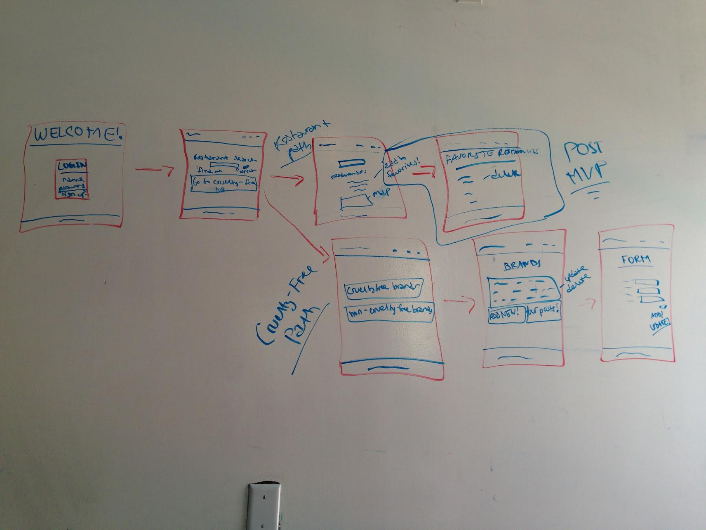

# project-4

## **Cruelty-Free-4-Me**
### **Your destination for all things cruelty-free!** 

This is an application that allows the user to view an open source community listing of cruelty-free and non-cruelty-free brands as well as vegan and vegetarian restaurants near their location. It will feature full CRUD functionality as well as a 3rd-party API call which will list restaurants near them as well as the precise location on Google Maps. Users will be able to register and log in, view, save, and delete their favorite restaurants, and view, add, update, or delete entries in both the cruelty-free and non-cruelty-free listings.

### **TECHNOLOGIES**
- BACK-END: Ruby on Rails
- FRONT-END: React or ERB
- CSS3 

### **WIREFRAMES**

----------------------------
### **USER STORIES**

---------------------------------
### **TIME PRIORITY MATRIX**

---------------------------------
## **Project Schedule**

|  Day | Deliverable | 
|---|---|
|Day 1: Fri| Planning |
|Day 2: Sat| CRUD and Auth: Rails |
|Day 3: Sun| CRUD and Auth: React |
|Day 4: Mon| API call for restaurants |
|Day 5: Tue| Display API call in React |
|Day 6: Wed| Integrate API with Google Maps |
|Day 6: Thu| Save/Delete feature for restaurants |
|Day 6: Fri| CSS |
|Day 6: Sat| CSS |
|Day 6: Sun| CSS and presentation |
---------------------------------
## **MVP**

MVP will be the user authentication, full CRUD on the cruelty-free tables, and the API call for the restaurants.

## **Post-MVP**

Post-MVP will be the Google Map integration as well as the save and delete functionality for the restaurants.
